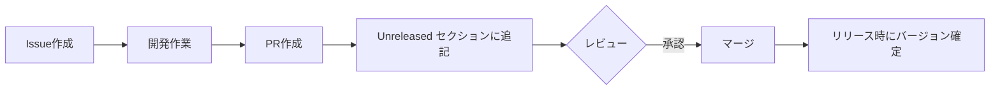

# CHANGELOG.md導入仕様書

## ドキュメント概要

このドキュメントでは、`CHANGELOG.md`の導入に関する仕様を定義します。変更履歴の管理方法、フォーマット、自動化の仕組みについて検討します。

## 作成日

2026年2月12日

---

## 1. 背景と目的

### 1.1 現状

- 現在、プロジェクトには`CHANGELOG.md`が存在しない
- バージョンは`package.json`で`0.19.0`として管理されている
- Git履歴からしか変更内容を追跡できない

### 1.2 問題点

- **追跡性の欠如**: バージョン間の変更内容が追跡しづらい
- **ユーザビリティの低下**: ユーザーが新機能や修正内容を把握しづらい
- **コミュニケーション不足**: 開発チームや利用者に変更内容を伝える公式な手段がない
- **リリースノートの不在**: リリース時にまとめた変更内容がない

### 1.3 目的

- プロジェクトの変更履歴を構造化して記録する
- 利用者や開発者が変更内容を簡単に把握できるようにする
- 標準的なフォーマットで一貫性のある変更履歴を維持する
- リリースプロセスの透明性を向上させる

---

## 2. CHANGELOG.mdの仕様

### 2.1 採用フォーマット

**[Keep a Changelog](https://keepachangelog.com/ja/1.1.0/)** 形式を採用します。

#### 採用理由

1. **業界標準**: 広く採用されている国際的な標準フォーマット
2. **人間にとって読みやすい**: マークダウン形式で構造化され、読みやすい
3. **機械的に解析可能**: 自動化ツールで解析しやすい構造
4. **日本語版が存在**: 公式に日本語訳されたドキュメントが存在
5. **セマンティックバージョニングと相性が良い**: 既存のバージョン管理方針と整合性がある

### 2.2 基本構造

```markdown
# Changelog

All notable changes to this project will be documented in this file.

The format is based on [Keep a Changelog](https://keepachangelog.com/ja/1.1.0/),
and this project adheres to [Semantic Versioning](https://semver.org/lang/ja/spec/v2.0.0.html).

## [Unreleased]

### Added
- 追加された新機能

### Changed
- 既存機能の変更

### Deprecated
- 非推奨となった機能

### Removed
- 削除された機能

### Fixed
- バグ修正

### Security
- セキュリティ関連の修正

## [1.0.0] - YYYY-MM-DD

### Added
- 初回リリース
```

### 2.3 変更タイプの分類

Keep a Changelogでは、以下の6つのカテゴリに変更を分類します：

| カテゴリ | 説明 | 例 |
|---------|------|-----|
| **Added** | 新機能の追加 | 新しいページの追加、新しいコンポーネントの実装 |
| **Changed** | 既存機能の変更 | UIの変更、アルゴリズムの改善 |
| **Deprecated** | 将来削除予定の機能 | 非推奨APIの宣言 |
| **Removed** | 削除された機能 | 古い機能やAPIの削除 |
| **Fixed** | バグ修正 | エラー修正、不具合対応 |
| **Security** | セキュリティ関連 | 脆弱性の修正、セキュリティ強化 |

### 2.4 バージョン表記規則

**Semantic Versioning 2.0.0** に準拠します。

```
MAJOR.MINOR.PATCH

例: 1.2.3
```

- **MAJOR**: 互換性のない変更を含む場合
- **MINOR**: 後方互換性のある機能追加の場合
- **PATCH**: 後方互換性のあるバグ修正の場合

### 2.5 日付形式

ISO 8601形式（YYYY-MM-DD）を使用します。

例: `2026-02-12`

### 2.6 リンク形式

各バージョンにGitHubのコミット比較リンクを付与します。

```markdown
## [1.0.0] - 2026-02-12

[1.0.0]: https://github.com/TakuyaFukumura/divichart-next-js-app/compare/v0.19.0...v1.0.0
```

---

## 3. 記載内容のガイドライン

### 3.1 記載すべき変更

以下のような変更は必ず記載します：

- ✅ 新機能の追加
- ✅ 既存機能の変更・改善
- ✅ バグ修正
- ✅ セキュリティ修正
- ✅ 依存関係の重要な更新（メジャーバージョンアップなど）
- ✅ 破壊的変更（Breaking Changes）
- ✅ 非推奨化（Deprecation）
- ✅ パフォーマンス改善

### 3.2 記載不要な変更

以下のような変更は記載を省略できます：

- ❌ コードのリファクタリング（動作に影響がない場合）
- ❌ ドキュメントの軽微な修正
- ❌ 内部的なテストコードの変更
- ❌ CI/CDの設定変更（ユーザーに影響がない場合）
- ❌ 開発者向けのツール変更

### 3.3 記載例

#### 良い例

```markdown
### Added
- ポートフォリオ分析ページを追加（#123）
- 配当金の為替レート変更機能を実装（#124）

### Fixed
- CSVファイルのShift-JISエンコーディング読み込みエラーを修正（#125）
- ダークモード時のグラフ表示バグを修正（#126）
```

#### 改善が必要な例

```markdown
### Added
- 新しい機能を追加  ← 具体性がない
- バグ修正  ← カテゴリが間違っている（FixedまたはSecurityに分類）

### Changed
- コードを修正  ← 曖昧で分かりづらい
```

### 3.4 推奨される記載スタイル

- **簡潔に**: 1行で内容が分かるようにする
- **ユーザー視点**: 技術的な詳細よりもユーザーへの影響を記載
- **Issue/PRへのリンク**: 関連するIssue番号やPR番号を記載（例: `(#123)`）
- **破壊的変更は明示**: `BREAKING CHANGE:` プレフィックスを付ける

---

## 4. 運用フロー

### 4.1 通常の開発フロー



### 4.2 開発時の更新方針

#### オプション1: PR作成時に更新（推奨）

- **方法**: PRを作成する際に、開発者が`Unreleased`セクションに変更内容を追記
- **メリット**:
  - 変更内容を開発者自身が記載するため、正確
  - レビュー時に変更履歴も確認できる
  - リリース時の作業が軽減される
- **デメリット**:
  - 開発者の負担が増える
  - コンフリクトが発生する可能性がある

#### オプション2: リリース時に一括更新

- **方法**: リリース担当者がリリース時にまとめて記載
- **メリット**:
  - 開発者の負担が少ない
  - コンフリクトが発生しにくい
- **デメリット**:
  - リリース時の作業負荷が高い
  - 変更内容を思い出すのが困難な場合がある

**推奨**: オプション1（PR作成時に更新）を採用し、コンフリクト防止のためにルールを明確化

### 4.3 リリース時の更新フロー

1. **バージョン番号の決定**
   - Semantic Versioningに基づいてバージョン番号を決定
   - `package.json`のバージョンを更新

2. **CHANGELOGの更新**
   - `Unreleased`セクションを新しいバージョンセクションに変更
   - リリース日を追加
   - 比較リンクを追加

3. **コミットとタグ作成**
   ```bash
   git add CHANGELOG.md package.json
   git commit -m "Release v1.0.0"
   git tag -a v1.0.0 -m "Release v1.0.0"
   git push origin main --tags
   ```

4. **GitHub Releaseの作成**
   - GitHubのRelease機能を使用してリリースノートを作成
   - CHANGELOGの該当バージョンの内容をコピー

---

## 5. 自動化の検討

### 5.1 自動化の目的

- 手作業によるミスを減らす
- 開発者の負担を軽減
- 一貫性のあるフォーマットを維持
- リリースプロセスを効率化

### 5.2 自動化ツールの選択肢

#### オプション1: 標準ツール

| ツール名 | 説明 | メリット | デメリット |
|---------|------|---------|-----------|
| **standard-version** | CHANGELOGとバージョン管理を自動化 | - Conventional Commitsと統合<br>- npmで広く使われている | - コミットメッセージの規約が必要<br>- 導入時の学習コストがある |
| **conventional-changelog** | コミットメッセージからCHANGELOGを生成 | - 柔軟なカスタマイズが可能<br>- プラグインエコシステムが豊富 | - 設定が複雑<br>- 日本語対応が限定的 |
| **semantic-release** | 完全自動化されたリリース管理 | - CI/CDと統合可能<br>- GitHubリリースも自動作成 | - 学習コストが高い<br>- 細かい制御が難しい |

#### オプション2: GitHub Actions

GitHub Actionsを使用した自動化フローの例：

```yaml
name: Release

on:
  push:
    tags:
      - 'v*'

jobs:
  release:
    runs-on: ubuntu-latest
    steps:
      - uses: actions/checkout@v4
      - name: Generate Changelog
        uses: conventional-changelog-action/conventional-changelog-action@v3
        with:
          config-file-path: .changelog/config.js
      - name: Create GitHub Release
        uses: actions/create-release@v1
        env:
          GITHUB_TOKEN: ${{ secrets.GITHUB_TOKEN }}
        with:
          tag_name: ${{ github.ref }}
          release_name: Release ${{ github.ref }}
          body_path: ./CHANGELOG.md
```

#### オプション3: 手動管理 + テンプレート支援

- PR作成時に自動的にCHANGELOGの更新を促すGitHub Action
- PRテンプレートにCHANGELOG更新のチェックリストを追加

### 5.3 推奨される自動化アプローチ

**段階的アプローチ**を推奨します：

#### フェーズ1: 手動管理（当面）

1. CHANGELOG.mdを手動で管理
2. PRテンプレートにCHANGELOG更新の項目を追加
3. 運用フローを確立

#### フェーズ2: 部分的自動化（将来）

1. Conventional Commitsの導入を検討
2. standard-versionやconventional-changelogの導入
3. GitHub Actionsでリリースノート生成を自動化

#### フェーズ3: 完全自動化（オプション）

1. semantic-releaseの導入
2. CI/CDと統合したリリースフロー

**理由**:
- 現状のプロジェクト規模では、完全自動化のコストが高い
- まずは手動でフローを確立し、運用の課題を把握
- 必要性が明確になった時点で段階的に自動化を導入

---

## 6. Conventional Commitsとの統合

### 6.1 Conventional Commitsとは

コミットメッセージに構造化された規約を導入する仕様です。

**基本形式**:
```
<type>(<scope>): <subject>

<body>

<footer>
```

**例**:
```
feat(portfolio): ポートフォリオ分析ページを追加

年別の銘柄別配当構成を円グラフと表で表示する機能を実装

Closes #123
```

### 6.2 タイプの定義

| タイプ | 説明 | CHANGELOGのカテゴリ |
|-------|------|-------------------|
| `feat` | 新機能 | Added |
| `fix` | バグ修正 | Fixed |
| `docs` | ドキュメント | （記載なし） |
| `style` | スタイル（コード整形など） | （記載なし） |
| `refactor` | リファクタリング | （記載なし） |
| `perf` | パフォーマンス改善 | Changed |
| `test` | テスト追加・修正 | （記載なし） |
| `chore` | ビルドプロセスやツールの変更 | （記載なし） |
| `security` | セキュリティ修正 | Security |

### 6.3 導入のメリット

- 自動化ツールがコミットメッセージを解析してCHANGELOGを生成可能
- コミット履歴が構造化され、検索しやすい
- バージョン番号の自動決定が可能

### 6.4 導入のデメリット

- 開発者の学習コストがある
- 規約を守る文化の醸成が必要
- 既存のコミット履歴との一貫性が失われる

### 6.5 推奨事項

**当面は導入せず、フェーズ2以降で検討**

理由:
- 現状のプロジェクト規模では、導入コストが高い
- まずはCHANGELOGの手動管理を確立
- 自動化の必要性が明確になった時点で導入を検討

---

## 7. 実装計画

### 7.1 初期セットアップ

#### ステップ1: CHANGELOG.mdの作成

1. プロジェクトルートに`CHANGELOG.md`を作成
2. Keep a Changelog形式のテンプレートを使用
3. 現在のバージョン（0.19.0）を基準に、過去の主要な変更を記載（オプション）

#### ステップ2: PRテンプレートの更新

`.github/PULL_REQUEST_TEMPLATE.md`にCHANGELOG更新のチェックリストを追加：

```markdown
## チェックリスト

- [ ] CHANGELOGを更新しました（該当する場合）
```

#### ステップ3: ドキュメントの更新

`README.md`にCHANGELOGへのリンクを追加：

```markdown
## 変更履歴

プロジェクトの変更履歴は[CHANGELOG.md](./CHANGELOG.md)を参照してください。
```

### 7.2 運用ルールの策定

#### CHANGELOGへの記載ルール

1. **記載タイミング**: PR作成時
2. **記載場所**: `Unreleased`セクション
3. **記載形式**: Keep a Changelogに準拠
4. **必須条件**:
   - ユーザーに影響がある変更は必ず記載
   - Issue/PR番号を記載（例: `(#123)`）
   - 破壊的変更は明示（`BREAKING CHANGE:`）

#### リリースルール

1. **リリース担当者**: プロジェクトメンテナー
2. **リリース頻度**: 必要に応じて（週次〜月次を想定）
3. **リリースプロセス**:
   - `Unreleased`を新バージョンに変更
   - `package.json`のバージョンを更新
   - コミット・タグ作成
   - GitHub Releaseの作成

### 7.3 タイムライン

| フェーズ | 期間 | 内容 |
|---------|------|------|
| **準備** | 1日 | CHANGELOG.mdの作成、テンプレート更新 |
| **運用開始** | 即日 | 手動管理の開始 |
| **評価** | 1-3ヶ月 | 運用の課題抽出 |
| **改善検討** | 必要に応じて | 自動化の導入検討 |

---

## 8. 期待される効果

### 8.1 開発者への効果

- ✅ 変更履歴が一元管理され、過去の変更を追跡しやすい
- ✅ リリース時の作業が標準化される
- ✅ PRレビュー時に変更内容を確認しやすい

### 8.2 ユーザーへの効果

- ✅ 新機能や修正内容を把握しやすい
- ✅ バージョンアップ時の影響を事前に確認できる
- ✅ 問題が修正されたか確認しやすい

### 8.3 プロジェクトへの効果

- ✅ 変更履歴の透明性が向上
- ✅ ドキュメントの品質が向上
- ✅ リリースプロセスが標準化される
- ✅ セマンティックバージョニングの運用が明確化される

---

## 9. リスクと対応策

### 9.1 想定されるリスク

| リスク | 影響 | 対応策 |
|-------|------|--------|
| 開発者がCHANGELOGの更新を忘れる | 中 | PRテンプレートにチェックリストを追加、レビュー時に確認 |
| コンフリクトが頻発する | 中 | Unreleased セクションを活用、カテゴリごとに分割 |
| 記載内容が不統一になる | 低 | ガイドラインを明確化、レビュー時に確認 |
| 手動管理の負担が大きい | 低 | 段階的に自動化を導入 |

### 9.2 成功の指標

- [ ] すべてのリリースで CHANGELOGが更新されている
- [ ] ユーザーからの「変更内容が分からない」という問い合わせが減少
- [ ] PRレビュー時に CHANGELOGの確認が習慣化されている

---

## 10. 参考資料

### 10.1 公式ドキュメント

- [Keep a Changelog（日本語版）](https://keepachangelog.com/ja/1.1.0/)
- [Semantic Versioning（日本語版）](https://semver.org/lang/ja/spec/v2.0.0.html)
- [Conventional Commits](https://www.conventionalcommits.org/)

### 10.2 ツール・ライブラリ

- [standard-version](https://github.com/conventional-changelog/standard-version)
- [conventional-changelog](https://github.com/conventional-changelog/conventional-changelog)
- [semantic-release](https://github.com/semantic-release/semantic-release)

### 10.3 参考事例

- [React CHANGELOG](https://github.com/facebook/react/blob/main/CHANGELOG.md)
- [Vue.js CHANGELOG](https://github.com/vuejs/core/blob/main/CHANGELOG.md)
- [Next.js CHANGELOG](https://github.com/vercel/next.js/blob/canary/CHANGELOG.md)

---

## 11. 付録

### 11.1 初期 CHANGELOG.md テンプレート

```markdown
# Changelog

このプロジェクトのすべての重要な変更は、このファイルに記録されます。

このフォーマットは [Keep a Changelog](https://keepachangelog.com/ja/1.1.0/) に基づいており、
このプロジェクトは [Semantic Versioning](https://semver.org/lang/ja/spec/v2.0.0.html) に準拠しています。

## [Unreleased]

### Added

### Changed

### Deprecated

### Removed

### Fixed

### Security

## [0.19.0] - 2026-02-12

### Added
- 初回CHANGELOG導入

[Unreleased]: https://github.com/TakuyaFukumura/divichart-next-js-app/compare/v0.19.0...HEAD
[0.19.0]: https://github.com/TakuyaFukumura/divichart-next-js-app/compare/v0.18.0...v0.19.0
```

### 11.2 PR作成時のチェックリスト例

```markdown
## CHANGELOG更新チェックリスト

以下の変更がある場合は、CHANGELOGを更新してください：

- [ ] 新機能の追加 → Added セクション
- [ ] 既存機能の変更 → Changed セクション
- [ ] バグ修正 → Fixed セクション
- [ ] セキュリティ修正 → Security セクション
- [ ] 非推奨化 → Deprecated セクション
- [ ] 機能の削除 → Removed セクション

記載が不要な変更：
- 内部的なリファクタリング
- テストコードのみの変更
- ドキュメントの軽微な修正
```

---

## 12. 変更履歴

| 日付 | バージョン | 変更内容 |
|------|-----------|---------|
| 2026-02-12 | 1.0.0 | 初版作成 |

---

## 13. 承認

| 役割 | 氏名 | 承認日 |
|-----|------|--------|
| 作成者 | GitHub Copilot | 2026-02-12 |
| レビュアー | - | - |
| 承認者 | - | - |
